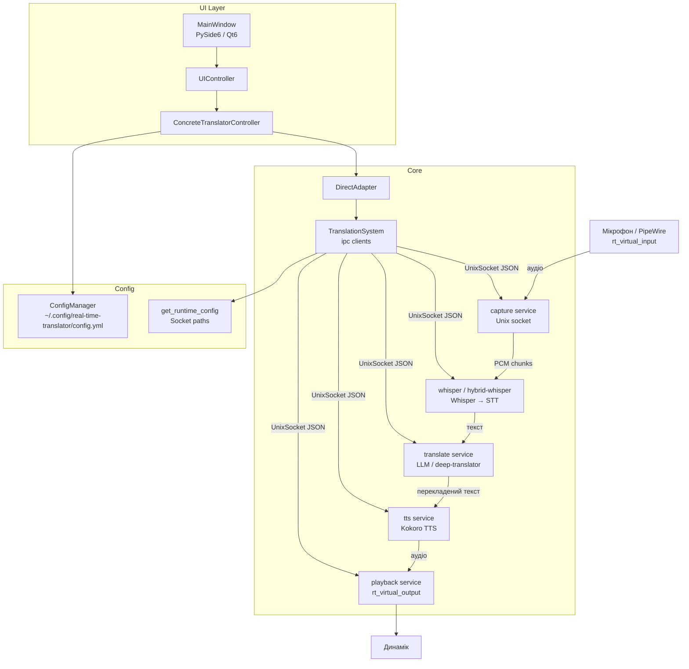

Ось верхньорівнева картина проекту:

**Основний потік:**
`Mic → capture → whisper → translate → TTS (Kokoro) → playback → Speaker`

**Комунікація:** всі сервіси — окремі процеси (або systemd units), спілкуються через Unix socket (JSON IPC).

**UI:** Qt6 → UIController → DirectAdapter → TranslationSystem → сокети до сервісів.

**Проблема з todo.md:** kokoro (TTS) тягне torch → CUDA → libnvshmem, що при Nix-збірці з сорців падає по OOM. Варіанти: cachix бінарний кеш, docker, або замінити kokoro на piper-tts.
