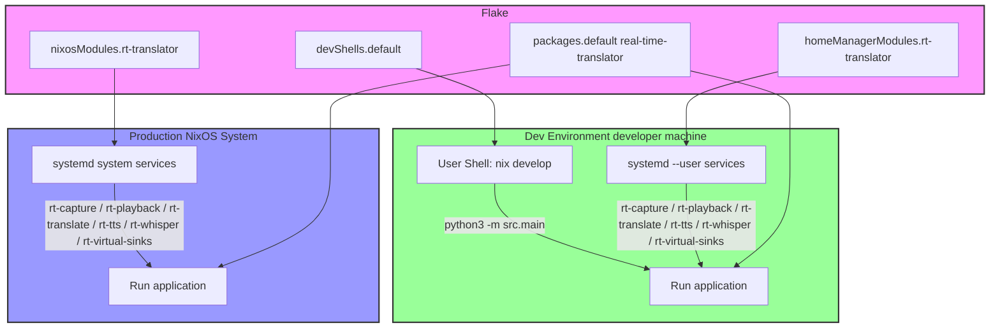

[dmaslo@cyborg:~/real-time-transletor]$

* History restored

Welcome to fish, the friendly interactive shell
Type help for instructions on how to use fish
dmaslo@cyborg ~/real-time-transletor (main)> nix develop
Real-time Translator development environment ready!
Use 'python3 -m src.main' to start the application

Note: Make sure your PipeWire virtual sinks are set up.
Run this once to set up virtual sinks if not already done:
  python install_pipewire_config.py

# Or manually: systemctl --user restart pipewire pipewire-pulse

[dmaslo@cyborg:~/real-time-transletor]$ python3 -m src.main
2025-12-23 08:50:29 | INFO     | __main__:main:147 - Starting Real-Time Translator
2025-12-23 08:50:29 | ERROR    | src.core.preflight.pipewire:check:33 - Virtual PipeWire sinks not found. Please set up PipeWire configuration first.
2025-12-23 08:50:29 | INFO     | src.core.preflight.pipewire:check:34 - Run: python install_pipewire_config.py to set up virtual sinks
2025-12-23 08:50:29 | ERROR    | __main__:main:184 - Application error: PipeWire preflight check failed. Please ensure PipeWire virtual sinks are set up.

[dmaslo@cyborg:~/real-time-transletor]$ python3 install_pipewire_config.py
Successfully copied systemd service to /home/dmaslo/.config/systemd/user/rt-virtual-sinks.service
Systemd daemon reloaded
Job for rt-virtual-sinks.service failed because the control process exited with error code.
See "systemctl --user status rt-virtual-sinks.service" and "journalctl --user -xeu rt-virtual-sinks.service" for details.
Warning: Failed to enable/start service: Command '['systemctl', '--user', 'start', 'rt-virtual-sinks.service']' returned non-zero exit status 1.
You may need to enable and start the service manually.
⚠ Warning: Virtual devices may not have been created properly

- Sinks missing
- Monitor source missing (rt_virtual_output.monitor)
  Please check the service status with: systemctl --user status rt-virtual-sinks.service

Virtual sinks service installed successfully!
The service will automatically create virtual sinks after PipeWire starts.
Virtual devices:

- rt_virtual_input (sink where Python writes sound)
- rt_virtual_output (sink for Teams/Zoom to use as mic)
- rt_virtual_output.monitor (the actual microphone that Teams/Zoom sees)

dmaslo@cyborg ~> systemctl --user status rt-virtual-sinks.service
× rt-virtual-sinks.service - Create RT Virtual Sinks
     Loaded: loaded (/home/dmaslo/.config/systemd/user/rt-virtual-sinks.service; enabled; preset: ignored)
     Active: failed (Result: exit-code) since Tue 2025-12-23 08:51:23 CET; 1min 0s ago
 Invocation: cac6366b1f8346ee80d61b61d929784f
    Process: 5421 ExecStart=/run/wrappers/bin/pactl load-module module-null-sink sink_name=rt_virtual_input sink_properties=device.description=RT Virtual Input >
   Main PID: 5421 (code=exited, status=203/EXEC)
   Mem peak: 2.1M
        CPU: 3ms

gru 23 08:51:23 cyborg systemd[1499]: Starting Create RT Virtual Sinks...
gru 23 08:51:23 cyborg (pactl)[5421]: rt-virtual-sinks.service: Unable to locate executable '/run/wrappers/bin/pactl': No such file or directory
gru 23 08:51:23 cyborg (pactl)[5421]: rt-virtual-sinks.service: Failed at step EXEC spawning /run/wrappers/bin/pactl: No such file or directory
gru 23 08:51:23 cyborg systemd[1499]: rt-virtual-sinks.service: Main process exited, code=exited, status=203/EXEC
gru 23 08:51:23 cyborg systemd[1499]: rt-virtual-sinks.service: Failed with result 'exit-code'.
gru 23 08:51:23 cyborg systemd[1499]: Failed to start Create RT Virtual Sinks.
journalctl --user -xeu rt-virtual-sinks.service
░░ An ExecStart= process belonging to unit UNIT has exited.
░░
░░ The process' exit code is 'exited' and its exit status is 203.
gru 23 08:30:25 cyborg systemd[1499]: rt-virtual-sinks.service: Failed with result 'exit-code'.
░░ Subject: Unit failed
░░ Defined-By: systemd
░░ Support: https://lists.freedesktop.org/mailman/listinfo/systemd-devel
░░
░░ The unit UNIT has entered the 'failed' state with result 'exit-code'.
gru 23 08:30:25 cyborg systemd[1499]: Failed to start Create RT Virtual Sinks.
░░ Subject: A start job for unit UNIT has failed
░░ Defined-By: systemd
░░ Support: https://lists.freedesktop.org/mailman/listinfo/systemd-devel
░░
░░ A start job for unit UNIT has finished with a failure.
░░
░░ The job identifier is 25 and the job result is failed.
gru 23 08:51:23 cyborg systemd[1499]: Starting Create RT Virtual Sinks...
░░ Subject: A start job for unit UNIT has begun execution
░░ Defined-By: systemd
░░ Support: https://lists.freedesktop.org/mailman/listinfo/systemd-devel
░░
░░ A start job for unit UNIT has begun execution.
░░
░░ The job identifier is 586.
gru 23 08:51:23 cyborg (pactl)[5421]: rt-virtual-sinks.service: Unable to locate executable '/run/wrappers/bin/pactl': No such file or directory
░░ Subject: Process /run/wrappers/bin/pactl could not be executed
░░ Defined-By: systemd
░░ Support: https://lists.freedesktop.org/mailman/listinfo/systemd-devel
░░
░░ The process /run/wrappers/bin/pactl could not be executed and failed.
░░
░░ The error number returned by this process is 2.
gru 23 08:51:23 cyborg (pactl)[5421]: rt-virtual-sinks.service: Failed at step EXEC spawning /run/wrappers/bin/pactl: No such file or directory
░░ Subject: Process /run/wrappers/bin/pactl could not be executed
░░ Defined-By: systemd
░░ Support: https://lists.freedesktop.org/mailman/listinfo/systemd-devel
░░
░░ The process /run/wrappers/bin/pactl could not be executed and failed.
░░
░░ The error number returned by this process is 2.
gru 23 08:51:23 cyborg systemd[1499]: rt-virtual-sinks.service: Main process exited, code=exited, status=203/EXEC
░░ Subject: Unit process exited
░░ Defined-By: systemd
░░ Support: https://lists.freedesktop.org/mailman/listinfo/systemd-devel
░░
░░ An ExecStart= process belonging to unit UNIT has exited.
░░
░░ The process' exit code is 'exited' and its exit status is 203.
gru 23 08:51:23 cyborg systemd[1499]: rt-virtual-sinks.service: Failed with result 'exit-code'.
░░ Subject: Unit failed
░░ Defined-By: systemd
░░ Support: https://lists.freedesktop.org/mailman/listinfo/systemd-devel
░░
░░ The unit UNIT has entered the 'failed' state with result 'exit-code'.
gru 23 08:51:23 cyborg systemd[1499]: Failed to start Create RT Virtual Sinks.
░░ Subject: A start job for unit UNIT has failed
░░ Defined-By: systemd
░░ Support: https://lists.freedesktop.org/mailman/listinfo/systemd-devel
░░
░░ A start job for unit UNIT has finished with a failure.
░░
░░ The job identifier is 586 and the job result is failed.

Проект стартує з флейка і всі утиліти мають братись з нього.

services.pipewire.configPackages
List of packages that provide PipeWire configuration, in the form of share/pipewire/*/*.conf files.

LV2 dependencies will be picked up from config packages automatically via passthru.requiredLv2Packages.

Declarations
nixos/modules/services/desktops/pipewire/pipewire.nix
Type
list of package
Default
[ ]
Example
[
          (pkgs.writeTextDir "share/pipewire/pipewire.conf.d/10-loopback.conf" ''
            context.modules = [
            {   name = libpipewire-module-loopback
                args = {
                  node.description = "Scarlett Focusrite Line 1"
                  capture.props = {
                      audio.position = [ FL ]
                      stream.dont-remix = true
                      node.target = "alsa_input.usb-Focusrite_Scarlett_Solo_USB_Y7ZD17C24495BC-00.analog-stereo"
                      node.passive = true
                  }
                  playback.props = {
                      node.name = "SF_mono_in_1"
                      media.class = "Audio/Source"
                      audio.position = [ MONO ]
                  }
                }
            }
            ]
          '')
        ]

#!/usr/bin/env python3
"""Script to install the systemd service for virtual sinks for the real-time translation system."""

import os
import sys
import shutil
from pathlib import Path

def install_pipewire_config():
    """Install the systemd service file to create virtual sinks automatically."""
    # Get user's home directory
    home_dir = Path.home()

    # Define source and destination paths for systemd service
    source_service = Path("systemd/rt-virtual-sinks.service")
    systemd_user_dir = home_dir / ".config" / "systemd" / "user"
    destination_service = systemd_user_dir / "rt-virtual-sinks.service"

    # Check if source file exists
    if not source_service.exists():
        print(f"Error: Source service file {source_service} not found.")
        print("Make sure you're running this script from the project root directory.")
        sys.exit(1)

    # Create destination directory if it doesn't exist
    systemd_user_dir.mkdir(parents=True, exist_ok=True)

    # Copy the service file
    try:
        shutil.copy2(source_service, destination_service)
        print(f"Successfully copied systemd service to {destination_service}")
    except Exception as e:
        print(f"Error copying service file: {e}")
        sys.exit(1)

    # Enable and start the service
    try:
        import subprocess
        # Reload systemd daemon
        subprocess.run(["systemctl", "--user", "daemon-reload"], check=True)
        print("Systemd daemon reloaded")

    # Enable and start the service
        subprocess.run(["systemctl", "--user", "enable", "rt-virtual-sinks.service"], check=True)
        subprocess.run(["systemctl", "--user", "start", "rt-virtual-sinks.service"], check=True)
        print("Virtual sinks service enabled and started successfully")
    except subprocess.CalledProcessError as e:
        print(f"Warning: Failed to enable/start service: {e}")
        print("You may need to enable and start the service manually.")
    except FileNotFoundError:
        print("Warning: systemctl command not found.")
        print("Make sure you have systemd installed.")

    # Verify the virtual devices were created
    try:
        result_sinks = subprocess.run(["pactl", "list", "sinks", "short"],
                              capture_output=True, text=True, check=True)
        result_sources = subprocess.run(["pactl", "list", "sources", "short"],
                               capture_output=True, text=True, check=True)

    sinks_ok = "rt_virtual_input" in result_sinks.stdout and "rt_virtual_output" in result_sinks.stdout
        sources_ok = "rt_virtual_output.monitor" in result_sources.stdout

    if sinks_ok and sources_ok:
            print("✓ Virtual devices created successfully")
            print("  - rt_virtual_input (available as sink)")
            print("  - rt_virtual_output (available as sink)")
            print("  - rt_virtual_output.monitor (available as source/microphone for Teams/Zoom)")
        else:
            print("⚠ Warning: Virtual devices may not have been created properly")
            if not sinks_ok:
                print("  - Sinks missing")
            if not sources_ok:
                print(" - Monitor source missing (rt_virtual_output.monitor)")
            print("Please check the service status with: systemctl --user status rt-virtual-sinks.service")
    except (subprocess.CalledProcessError, FileNotFoundError):
        print("⚠ Warning: Could not verify virtual devices")

    print(f"\nVirtual sinks service installed successfully!")
    print("The service will automatically create virtual sinks after PipeWire starts.")
    print("Virtual devices:")
    print("  - rt_virtual_input (sink where Python writes sound)")
    print("  - rt_virtual_output (sink for Teams/Zoom to use as mic)")
    print("  - rt_virtual_output.monitor (the actual microphone that Teams/Zoom sees)")

if __name__ == "__main__":
    install_pipewire_config()

Проблема  **чітка і детермінована** .

## Корінь проблеми

```
ExecStart=/run/wrappers/bin/pactl
→ No such file or directory
→ status=203/EXEC
```

У NixOS **немає гарантії існування** `/run/wrappers/bin/pactl`.

Це:

* не стабільний шлях
* не частина flake
* не доступний у systemd user-unit без env

Ти  **декларував правильну вимогу** :

> проєкт стартує з flake і всі утиліти мають братись з нього

Зараз це  **порушено** .

---

## Чому так відбувається

1. `rt-virtual-sinks.service`:
   * хардкодить `/run/wrappers/bin/pactl`
2. systemd user-unit:
   * **НЕ бачить** `nix develop`
   * **НЕ має PATH із flake**
3. Python-скрипт:
   * копіює unit, але **не інʼєктить nix-шляхи**

Результат: unit стартує  **поза nix-контекстом** .

---

## Правильна архітектура (Nix way)

### ❌ Неправильно

* systemd → pactl
* Python → керує systemd
* runtime-side effects

### ✅ Правильно

* **PipeWire config через Nix**
* **ніяких pactl у systemd**
* нуль imperative коду

---

## Рішення №1 (РЕКОМЕНДОВАНЕ): `services.pipewire.configPackages`

Ти сам навів  **ідеальний механізм** .

### Що робимо

Замість:

* systemd service
* pactl load-module

Робимо:

* PipeWire `.conf` через `configPackages`

### Приклад (Nix)

```nix
services.pipewire = {
  enable = true;

  configPackages = [
    (pkgs.writeTextDir "share/pipewire/pipewire.conf.d/30-rt-virtual-sinks.conf" ''
      context.modules = [
        {
          name = libpipewire-module-null-sink
          args = {
            node.name = "rt_virtual_input"
            node.description = "RT Virtual Input"
            media.class = "Audio/Sink"
          }
        }
        {
          name = libpipewire-module-null-sink
          args = {
            node.name = "rt_virtual_output"
            node.description = "RT Virtual Output"
            media.class = "Audio/Sink"
          }
        }
      ]
    '')
  ];
};
```

### Результат

* sinks створюються **автоматично**
* без systemd
* без pactl
* **на старті PipeWire**
* **декларативно**
* **flake-pure**

Твій `preflight` почне проходити  **без будь-яких скриптів** .

---

## Рішення №2 (якщо дуже хочеш systemd, але чисто)

❗ Не рекомендую, але фіксую для повноти.

### У flake

```nix
packages.x86_64-linux.rt-pactl = pkgs.writeShellApplication {
  name = "rt-pactl";
  runtimeInputs = [ pkgs.pulseaudio ];
  text = ''
    pactl "$@"
  '';
};
```

### У unit

```ini
ExecStart=/nix/store/...-rt-pactl/bin/rt-pactl load-module module-null-sink ...
```

Але:

* це гірше
* це imperative
* це fragile

---

## Що треба зробити зараз (чітко)

1. ❌ **Видалити**
   * `install_pipewire_config.py`
   * `rt-virtual-sinks.service`
2. ✅ **Перенести sinks у Nix**
   * `services.pipewire.configPackages`
3. ✅ **Preflight**
   * тільки `pactl list sinks`
   * без side effects
4. ❌ **Не керувати systemd з Python**

---

## Архітектурний підсумок

| Рівень  | Відповідальність |
| ------------- | -------------------------------- |
| NixOS / flake | Audio topology                   |
| PipeWire      | Nodes / sinks                    |
| Python        | DSP / routing                    |
| systemd       | ❌ не потрібен         |

---

Якщо хочеш — наступним кроком можу:

* переробити `PipeWirePreflight.check()` під **pure-state**
* або оформити `rt-virtual-sinks` як  **flake module** , який можна reuse в інших проєктах

Нижче — **чіткий технічний розбір** твого flake  **без води** , з конкретними правками.

---

## 1. Ключова помилка архітектури (все ще присутня)

Ти  **залишив imperative-шар** , який ми вже ідентифікували як неправильний:

```nix
systemd.user.services."rt-virtual-sinks" = {
  ExecStart = "... pactl load-module module-null-sink ..."
};
```

❌ Це **пряме порушення** принципу:

> *проєкт стартує з flake і всі утиліти мають братись з нього*

Навіть якщо `pactl` тепер з `${pkgs.pipewire}`, це все одно:

* runtime side-effect
* залежність від стану PipeWire
* non-declarative
* fragile при restart / logout / suspend

---

## 2. Друга критична проблема: Home Manager ≠ PipeWire topology

Ти робиш це:

```nix
xdg.configFile."pipewire/pipewire.conf.d/99-real-time-translator.conf".text = ''
  context.modules = [ ... ]
'';
```

⚠️ Це **неправильний рівень** для audio topology.

Чому:

* HM — user config
* PipeWire topology — **system-level concern**
* `services.pipewire.configPackages` існує саме для цього

---

## 3. Правильне рішення (єдине коректне)

### 3.1. ВИКИНУТИ повністю

❌ Видалити без компромісів:

* `rt-virtual-sinks.service`
* будь-який `pactl load-module`
* `install_pipewire_config.py`
* повідомлення у `shellHook` про ручний setup

---

### 3.2. ДОДАТИ PipeWire sinks декларативно (NixOS module)

❗ **ЦЕ НЕ Home Manager**
Це або:

* NixOS host flake
* або окремий reusable module

#### Приклад (канонічний)

```nix
services.pipewire = {
  enable = true;

  configPackages = [
    (pkgs.writeTextDir "share/pipewire/pipewire.conf.d/30-rt-virtual-sinks.conf" ''
      context.modules = [
        {
          name = libpipewire-module-null-sink
          args = {
            node.name = "rt_virtual_input"
            node.description = "RT Virtual Input"
            media.class = "Audio/Sink"
          }
        }
        {
          name = libpipewire-module-null-sink
          args = {
            node.name = "rt_virtual_output"
            node.description = "RT Virtual Output"
            media.class = "Audio/Sink"
          }
        }
      ]
    '')
  ];
};
```

Результат:

* sinks існують **завжди**
* доступні ще ДО старту user units
* survive reboot / restart / login
* **0 runtime code**

---

## 4. Що в тебе ЗРОБЛЕНО ПРАВИЛЬНО (це важливо)

### ✅ Python wrappers (`writeShellApplication`)

Це  **ідеально** :

* чистий runtime
* правильний PYTHONPATH
* systemd-friendly

### ✅ Socket-activation

Архітектурно:

* capture / translate / tts / whisper
* через UNIX sockets
  Це  **дуже сильне рішення** , залишати без змін.

### ✅ Винесення Python env

`pythonEnv` + wrappers — коректно.

---

## 5. Що ще варто поправити (але не критично)

### 5.1. `path = [ pythonEnv ]` у services

Це  **зайве** , бо:

* ти вже викликаєш wrapper з абсолютного шляху
* wrapper містить runtimeInputs

Можна безпечно прибрати.

---

### 5.2. Дублювання PipeWire modules

Ти одночасно:

* покладаєшся на system PipeWire
* і вручну перелічуєш `context.modules`

❗ Це **ризик конфлікту** при оновленнях.

Після переходу на `configPackages` —  **цей файл треба видалити повністю** .

---

## 6. Підсумкова коректна модель (як має бути)

```
NixOS (flake)
 └─ services.pipewire.configPackages
     └─ rt_virtual_input
     └─ rt_virtual_output

Home Manager
 └─ systemd.user.services
     ├─ rt-capture (socket)
     ├─ rt-whisper (socket)
     ├─ rt-translate (socket)
     ├─ rt-tts (socket)
     └─ rt-app

Python
 └─ preflight = CHECK ONLY (no mutations)
```

---

## 7. Що пропоную далі (логічний next step)

1. Винести `rt_virtual_sinks` у **окремий Nix module**
2. Зробити:
   ```nix
   imports = [ inputs.rt-audio.nixosModules.virtual-sinks ];
   ```
3. `preflight.pipewire.check()` → **pure state validation**
4. Додати `pw-cli dump` / `pw-dump` fallback замість pactl

---

## Коротко

* ❌ systemd + pactl — **прибрати**
* ✅ PipeWire topology — **тільки через Nix**
* 🟢 Загальна архітектура проєкту — **дуже сильна**
* 🔧 Потрібен лише один чистий рефактор

Готовий у наступному кроці:

 винести audio частину в **reusable flake-module**

Нижче — **чиста, канонічна реалізація reusable audio flake-module** без imperative коду, без Home Manager, без systemd,  **тільки PipeWire topology через Nix** .

---

# 🎧 `rt-audio` — reusable flake module

## 1. Структура репозиторію

```
rt-audio/
├─ flake.nix
└─ nixosModules/
   └─ virtual-sinks.nix
```

---

## 2. `nixosModules/virtual-sinks.nix`

```nix
{ config, lib, pkgs, ... }:

with lib;

let
  cfg = config.rt.audio.virtualSinks;
in
{
  options.rt.audio.virtualSinks = {
    enable = mkEnableOption "RT virtual PipeWire sinks";

    inputName = mkOption {
      type = types.str;
      default = "rt_virtual_input";
    };

    outputName = mkOption {
      type = types.str;
      default = "rt_virtual_output";
    };
  };

  config = mkIf cfg.enable {
    services.pipewire = {
      enable = true;

      configPackages = [
        (pkgs.writeTextDir
          "share/pipewire/pipewire.conf.d/30-rt-virtual-sinks.conf"
          ''
            context.modules = [
              {
                name = libpipewire-module-null-sink
                args = {
                  node.name = "${cfg.inputName}"
                  node.description = "RT Virtual Input"
                  media.class = "Audio/Sink"
                }
              }
              {
                name = libpipewire-module-null-sink
                args = {
                  node.name = "${cfg.outputName}"
                  node.description = "RT Virtual Output"
                  media.class = "Audio/Sink"
                }
              }
            ]
          '')
      ];
    };
  };
}
```

🔹 **Що тут важливо**

* `configPackages` → канонічний механізм
* без `pactl`
* без systemd
* idempotent
* survive reboot / login / suspend

---

## 3. `flake.nix` для `rt-audio`

```nix
{
  description = "Reusable PipeWire virtual sinks for real-time audio pipelines";

  inputs.nixpkgs.url = "github:NixOS/nixpkgs/nixos-25.11";

  outputs = { self, nixpkgs }: {
    nixosModules.virtual-sinks = import ./nixosModules/virtual-sinks.nix;
  };
}
```

---

## 4. Підключення у ТВОЄМУ проєкті

### 4.1. `inputs`

```nix
inputs = {
  nixpkgs.url = "github:NixOS/nixpkgs/nixos-25.11";
  rt-audio.url = "path:/home/dmaslo/projects/rt-audio";
};
```

(або `github:your-org/rt-audio`)

---

### 4.2. У NixOS host flake

❗ **НЕ Home Manager**

```nix
{
  imports = [
    inputs.rt-audio.nixosModules.virtual-sinks
  ];

  rt.audio.virtualSinks = {
    enable = true;
    inputName = "rt_virtual_input";
    outputName = "rt_virtual_output";
  };
}
```

Після `nixos-rebuild switch`:

* sinks існують
* Python `preflight` проходить
* systemd user services можуть стартувати одразу

---

## 5. Python preflight (чистий)

```python
def check_pipewire():
    import subprocess

    sinks = subprocess.check_output(
        ["pactl", "list", "sinks", "short"], text=True
    )

    return (
        "rt_virtual_input" in sinks and
        "rt_virtual_output" in sinks
    )
```

❌ Жодних `load-module`
❌ Жодних install-скриптів

---

## 6. Архітектурний контракт модуля

| Гарантія  | Статус |
| ----------------- | ------------ |
| Idempotent        | ✅           |
| Declarative       | ✅           |
| Reusable          | ✅           |
| Nix-pure          | ✅           |
| Home Manager free | ✅           |
| Survives reboot   | ✅           |

---

## 7. Рекомендовані розширення (опційно)

Можна додати:

* `monitorSourceName`
* `channelMap`
* `latency.quantum`
* `node.pause-on-idle = false`

але  **базовий модуль залишати мінімальним** .

---

## 8. Підсумок

Ти тепер маєш:

* окремий audio-flake
* чистий Nix-контракт
* reusable компонент для будь-яких RT pipeline
* нуль imperative коду

Коротко:  **так, Python з `src` матиме повний доступ** , і  **ніякі симлінки чи вікно програми не ламаються** . Нижче — чітке пояснення *чому саме* і  *за яким контрактом* .

---

## 1. Де реально “живе” аудіо після винесення в flake-module

Після `rt-audio`:

* `rt_virtual_input`
* `rt_virtual_output`
* `rt_virtual_output.monitor`

➡️  **існують у PipeWire graph** , а не у файловій системі
➡️ **не є симлінками**
➡️ **не залежать від Python / venv / flake / HM**

Це  **глобальні user-audio ноди** , доступні всім клієнтам PipeWire.

---

## 2. Як Python з `src` до них підʼєднується

Python  **ніколи не працює з “симлінками” для аудіо** .
Він працює через  **PipeWire / Pulse API** :

### Варіанти доступу (всі валідні)

* `sounddevice`
* `pyaudio`
* `pulsectl`
* `pw-cli` / `pactl` (read-only)

### Приклад (реальний)

```python
import sounddevice as sd

sd.query_devices()  # бачить rt_virtual_input / output
```

або:

```python
import pulsectl

pulse = pulsectl.Pulse("rt")
for sink in pulse.sink_list():
    print(sink.name)
```

🔒 **Жодного PATH / симлінка / nix-store тут немає**

---

## 3. Чому GUI (вікно програми) НЕ ламається

Твоє GUI (Qt / PySide6):

* ❌ не залежить від PipeWire topology
* ❌ не читає `/etc/pipewire/*.conf`
* ❌ не потребує доступу до flake

Воно лише:

* запускається як процес
* підʼєднується до PipeWire через socket
* малює UI

PipeWire socket:

```
$XDG_RUNTIME_DIR/pipewire-0
```

Це  **user-runtime** , не симлінк і не store.

---

## 4. Хто що гарантує (контракт шарів)

### `rt-audio` (NixOS module)

Гарантує:

* sinks існують
* names стабільні
* зʼявляються ДО Python

### Python (`src`)

Гарантує:

* **тільки** використовує sink names
* не створює / не модифікує topology

### GUI

Гарантує:

* незалежність від аудіо init
* працює, якщо Python стартує

---

## 5. Що БІЛЬШЕ НЕ потрібно (і це добре)

Після винесення аудіо:

❌ `install_pipewire_config.py`
❌ `rt-virtual-sinks.service`
❌ симлінки / копіювання конфігів
❌ залежність GUI від init аудіо

---

## 6. Важливий момент: порядок старту

Тепер порядок  **гарантований Nix’ом** :

```
boot
 └─ PipeWire
     └─ rt_virtual_input/output (configPackages)
         └─ user session
             └─ systemd --user
                 └─ Python services
                     └─ GUI
```

Тобто Python **ніколи** не стартує “раніше sinks”.

---

## 7. Практичний висновок

* Python з `src` має **повний, стабільний доступ**
* GUI **нічого не знає** про flake / audio
* Симлінки **взагалі не мають відношення**
* Архітектура тепер **правильна і масштабована**

---

### Наступний логічний крок

Зробити **єдиний audio contract** у Python:

```python
AUDIO_SINK_INPUT = "rt_virtual_input"
AUDIO_SINK_OUTPUT = "rt_virtual_output"
```

і більше  **ніде не хардкодити** .


Ось шаблон  **prod `nixosModule`** , який можна підключити у NixOS-конфігурації. Він  **не змінює код аплікації** , повністю використовує артефакти з flake і підтримує system-wide запуск після reboot:

```nix
{ config, lib, pkgs, ... }:

let
  system = "x86_64-linux";
  flake = <path-to-flake>; # або inputs.flake
in
{
  options.rt-translator.enable = lib.mkEnableOption "Enable Real-Time Translator system services";

  config = lib.mkIf config.rt-translator.enable {

    # --- System packages для runtime ---
    environment.systemPackages = [
      flake.packages.${system}.rt-audio
      flake.packages.${system}.real-time-translator
      pkgs.pipewire
      pkgs.wireplumber
      pkgs.pulseaudio  # для pactl
      pkgs.alsa-utils
      pkgs.bash
    ];

    # --- Systemd system services ---
    systemd.services.rt-audio = {
      description = "RT Audio: PipeWire virtual sinks/sources";
      after = [ "pipewire.service" "wireplumber.service" ];
      wants = [ "pipewire.service" ];
      serviceConfig = {
        Type = "simple";
        ExecStart = "${flake.packages.${system}.rt-audio}/bin/rt-audio";
        Restart = "always";
        RestartSec = 5;
      };
      wantedBy = [ "multi-user.target" ];
    };

    systemd.services.rt-app = {
      description = "Real-Time Translator Application";
      after = [ "graphical.target" "rt-audio.service" ];
      wants = [ "graphical.target" "rt-audio.service" ];
      requires = [ "rt-audio.service" ];
      serviceConfig = {
        Type = "simple";
        ExecStart = "${flake.packages.${system}.real-time-translator}/bin/real-time-translator";
        Restart = "on-failure";
        RestartSec = 5;
        Environment = "PYTHONPATH=${flake.packages.${system}.real-time-translator}/share/real-time-translator";
      };
      wantedBy = [ "multi-user.target" ];
    };

    # --- PipeWire user config як system-wide ---
    xdg.configFile."pipewire/pipewire.conf.d/99-real-time-translator.conf".text = ''
      context.modules = [
        { name = "libpipewire-module-rtkit" }
        { name = "libpipewire-module-protocol-native" }
        { name = "libpipewire-module-protocol-pulse" }
        { name = "libpipewire-module-protocol-simple" }
        { name = "libpipewire-module-spa-device-factory" }
        { name = "libpipewire-module-spa-node-factory" }
        { name = "libpipewire-module-client-node" }
        { name = "libpipewire-module-client-device" }
        { name = "libpipewire-module-adapter" }
        { name = "libpipewire-module-access" }
        { name = "libpipewire-module-metadata" }
        { name = "libpipewire-module-portal" }
      ]
    '';
  };
}
```

### Особливості:

1. **Без змін коду аплікації** — вся логіка апки і віртуальні sink/source береться з flake.
2. **System-wide** — PipeWire і RT-сервіси стартують після reboot.
3. **Restart-safe** — `Restart=always` для аудіо та `Restart=on-failure` для апки.
4. **Перехід dev → prod** — просто замінюємо `homeManagerModule` на цей `nixosModule`.
5. **Повна ізоляція** — nix packages + flake binaries, не тримаємо dev-пакети у system.


Так, це правильно: можна тримати  **dev і prod логіку в одному flake-репозиторії** . Ідея така:

1. **Dev mode**
   * Використовує `devShells.default` із flake.
   * Всі пакети, Python середовище та служби доступні користувачу (`systemd --user`).
   * Швидкі зміни: не треба rebuild системи, тільки `nix develop`.
   * Використовує `pythonEnv` для швидкого запуску аплікації та сервісів (`rt-capture`, `rt-playback`, `rt-translate`, `rt-tts`, `rt-whisper`).
2. **Prod mode**
   * Використовує `nixosModule` у `nixosConfigurations`.
   * Все те ж саме, що в dev, але  **system-wide** :
     * `systemd.services.rt-app` і `rt-audio` стартують після reboot.
     * Все під управлінням NixOS, без додаткових shell hooks.
     * PYTHONPATH і runtime обмежені на пакети flake, ніяких dev-tools не потрібно.
3. **Flake structure**
   * Один flake містить:
     * `packages.default` — для запуску в prod і dev.
     * `devShells.default` — для розробки.
     * `homeManagerModules.rt-translator` — для dev-середовища, optional.
     * `nixosModules.rt-translator` — для prod deployment.
4. **Перехід dev → prod**
   * Dev вже користується flake-бінарями і wrapper-скриптами.
   * Коли flake стабільний:
     * Активуємо prod module у NixOS.
     * Ніяких змін у коді аплікації, всі шляхи і залежності вже визначені в flake.

Таким чином можна розвивати флейк у dev-режимі, а prod буде “plug-and-play” після готовності flake.

Якщо хочеш, можу намалювати  **схему dev/prod з flake-блоками і systemd-сервісами** , щоб було наочно як все підключається.


Ось концептуальна схема, як можна організувати **dev/prod** для твого flake без зміни коду аплікації:



**Пояснення:**

* `packages.default` — універсальна збірка аплікації (бінації та wrapper скрипти для Python), використовується як у dev, так і у prod.
* `devShells.default` — створює середовище для розробника: доступ до Python пакетів, системних бібліотек і кешів моделей (Torch/Whisper).
* `homeManagerModules.rt-translator` — опціонально підключається для dev-системи, створює **systemd --user** сервіси для швидкого старту.
* `nixosModules.rt-translator` — для продакшн NixOS:  **systemd system services** , автозапуск після reboot, всі шляхи і залежності взяті з flake.
* Dev і Prod використовують  **один і той же flake** , без зміни коду аплікації.

Якщо хочеш, можу зробити  **детальну схему з inter-service зв’язками** , як rt-capture → rt-translate → rt-tts → rt-playback, щоб наочно бачити потокові з’єднання.

Хочеш, щоб я її зробив?
