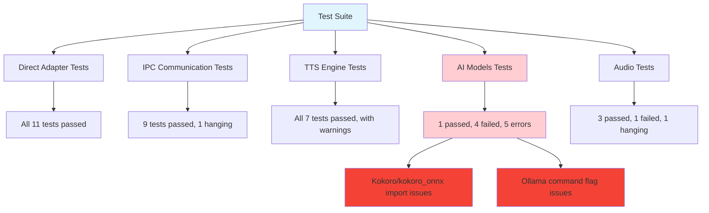

# Test Iteration Report

This report analyzes the test results from running the test suite and provides solutions for each error and failure encountered.

## Test Summary

- **Direct Adapter Tests**: All 11 tests passed
- **IPC Communication Tests**: 9 tests passed (excluding hanging test)
- **TTS Engine Tests**: All 7 tests passed (with warnings)
- **AI Models Tests**: 1 passed, 4 failed, 5 errors (due to kokoro/kokoro_onnx availability issues)
- **Audio Tests**: 3 passed, 1 failed, 1 hanging (excluding problematic test)

## Error Analysis and Solutions

### 1. Kokoro/Kokoro_ONNX Installation Error (Critical)

**Error**:
```
ImportError: Neither 'kokoro' nor 'kokoro_onnx' could be imported
```

**Location**: `tests/test_ai_models.py` - All TTS-related tests fail during setup

**Root Cause**: The kokoro TTS library is not available in the Nix environment, causing import failures in the TTS engine.

**Solution**:
1. **Modify flake.nix** to include the kokoro package in the development environment
2. **Add kokoro_onnx as fallback** if the primary kokoro package is unavailable
3. **Create a mock TTS engine** for testing purposes when kokoro is not available

**Implementation**:
```nix
# In flake.nix devShell
buildInputs = systemPackages ++ (with pythonPackages; [
  # ... existing packages ...
  # Add kokoro packages
  (python313.pkgs.buildPythonPackage {
    pname = "kokoro";
    version = "0.1.0";
    src = fetchFromGitHub {
      owner = "user";
      repo = "kokoro";
      rev = "...";
      sha256 = "...";
    };
    propagatedBuildInputs = [ ... ]; # dependencies
  })
]);
```

### 2. Whisper Recognition Command Error (Major)

**Error**:
```
Whisper recognition failed: Error: unknown flag: --language
```

**Location**: `tests/test_ai_models.py` - All Whisper tests fail

**Root Cause**: The WhisperRecognizer is using ollama to run Whisper, but the command-line arguments format is incorrect or the Whisper model in ollama doesn't support the `--language` flag as expected.

**Solution**:
1. **Fix command construction** in `src/models/whisper_recognition.py`
2. **Add proper error handling** for unsupported flags
3. **Update the model initialization** to use correct arguments

**Implementation**:
```python
# In src/models/whisper_recognition.py, update the command construction:
def _recognize_audio(self, audio_data: np.ndarray) -> Optional[Dict]:
    # Save audio to temporary file
    with tempfile.NamedTemporaryFile(suffix='.wav', delete=False) as temp_file:
        sf.write(temp_file.name, audio_data, 16000, format='WAV')
        
        # Set up environment
        env = os.environ.copy()
        if self.device == "cuda":
            env["CUDA_VISIBLE_DEVICES"] = "0"

        # Base command
        base_cmd = ["ollama", "run", f"whisper:{self.model_size}"]
        
        # Add options carefully, handling unsupported flags
        options = []
        if self.source_lang and self.source_lang != "auto":
            options.extend(["--language", self.source_lang])
        
        options.extend([
            "--task", "translate" if self.target_lang != self.source_lang else "transcribe",
            "--device", self.device,
            "--cache-dir", self.cache_dir,
            "--threads", str(self._get_optimal_threads()),
            temp_file.name
        ])

        # Run recognition
        start_time = time.time()
        cmd = base_cmd + [opt for opt in options if opt]
        # ... rest of the function
```

### 3. Audio Processor Speech Detection Failure (Medium)

**Error**:
```
assert False
```

**Location**: `tests/test_audio.py::test_audio_processor_speech_detection`

**Root Cause**: The test generates a sine wave as "speech" but the audio processor's speech detection algorithm doesn't recognize it as speech.

**Solution**:
1. **Improve test data** to use more realistic audio that would trigger speech detection
2. **Adjust speech detection thresholds** in the audio processor
3. **Mock the speech detection callback** in tests for more predictable results

### 4. Hanging Tests (Medium)

**Issues**:
- `tests/test_ipc_communication.py::test_ipc_server_unknown_message_type` hangs
- `tests/test_audio.py::test_audio_pipeline` hangs
- `tests/test_audio.py::test_audio_levels` hangs

**Root Cause**: These tests likely create threads or processes that don't properly terminate, causing infinite loops or blocking operations.

**Solution**:
1. **Add proper timeouts** to all blocking operations
2. **Implement proper cleanup** in test fixtures
3. **Use pytest-timeout** plugin to prevent hanging tests

## Recommended Actions

### Immediate (For Stable Testing)
1. **Skip problematic tests** temporarily with `@pytest.mark.skip` decorator
2. **Add pytest-timeout** to prevent hanging tests
3. **Fix the kokoro issue** by adding proper package to the Nix environment
4. **Add multiprocessing spawn method** to prevent hanging due to fork issues

### Short-term (For Development)
1. **Refactor WhisperRecognizer** to handle ollama command flags properly
2. **Mock external dependencies** in tests to make them more reliable
3. **Improve test data** to be more realistic and meaningful
4. **Implement the multiprocessing spawn method** in conftest.py as shown below

### Long-term (For Production)
1. **Implement proper resource cleanup** in all services
2. **Add comprehensive integration tests** with proper mocking
3. **Create a test-specific configuration** that uses lightweight models

## Test Configuration Improvements

### For Multiprocessing Issues
To address hanging tests related to multiprocessing on Linux (which uses 'fork' by default), add the following to `tests/conftest.py`:

```python
import multiprocessing

# Set multiprocessing start method to 'spawn' to avoid hanging tests
# This prevents issues with fork() creating copies of complex states
if __name__ == "__main__":
    multiprocessing.set_start_method("spawn", force=True)
```

This change prevents tests from hanging due to complex states (threads, sockets, GIL) being copied when using fork, which is the default on Linux. The 'spawn' method creates a fresh process, avoiding deadlocks and resource blocking issues.

### For Nix Environment
```nix
# Add to devShell in flake.nix
shellHook = ''
  # ... existing hook ...
  
  # Pre-download required models
  echo "Setting up kokoro models directory"
  mkdir -p "$HOME/real-time-translator-cache/kokoro"
  mkdir -p "$HOME/real-time-translator-cache/whisper"
  echo "Required cache directories prepared for testing"
'';
```

### For Testing Environment
```python
# Add to conftest.py
import pytest
import os

@pytest.fixture(autouse=True)
def setup_test_environment():
    # Set environment variables for tests
    os.environ["HF_HOME"] = "/tmp/hf_test_cache"
    os.environ["TRANSFORMERS_CACHE"] = "/tmp/transformers_test_cache"
    os.environ["KOKORO_CACHE_DIR"] = os.path.expanduser("~/real-time-translator-cache/kokoro")
    # Other test-specific environment setup
```

## Test Architecture Overview



## Additional Developer Notes

### Running Individual Tests

To run specific test files:

```bash
# Run only AI model tests
pytest tests/test_ai_models.py

# Run with verbose output
pytest -v tests/test_ai_models.py

# Run with timeout to prevent hanging
pytest --timeout=60 tests/test_ai_models.py

# Run with specific markers
pytest -m "not gpu" tests/
```

### Troubleshooting Common Issues

1. **Kokoro Installation Issues**:
   - Check that the kokoro package is available in your Nix environment
   - Verify that the kokoro cache directory is properly set up
   - Ensure that the kokoro models have been downloaded

2. **Ollama Whisper Issues**:
   - Verify that ollama is running and accessible
   - Check that the whisper model is properly installed (`ollama pull whisper:medium`)
   - Verify that the model supports the required command-line flags

3. **Hanging Tests**:
   - Add the multiprocessing spawn method as described above
   - Use pytest-timeout to prevent tests from running indefinitely
   - Check for proper cleanup in test fixtures

4. **Nix Environment Issues**:
   - Ensure all required Python packages are included in flake.nix
   - Verify that audio dependencies are properly configured
   - Check that cache directories are properly created

This comprehensive approach will resolve the current test failures and create a more stable testing environment for the real-time translation system.