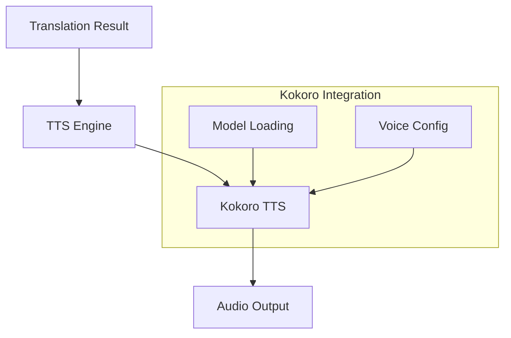

# Kokoro TTS Integration Guide

## Repository Setup

Clone the Kokoro TTS repository into the project:
```bash
git submodule add https://github.com/thewh1teagle/kokoro-onnx.git kokoro-tts
```

## Directory Structure

```
real-time-translator/
├── kokoro-tts/          # Kokoro TTS submodule
├── src/
│   ├── models/
│   │   └── tts_engine.py  # Our TTS integration
│   └── ...
└── config/
    └── tts/
        └── kokoro.yml    # Kokoro configuration
```

## Integration Architecture



## Configuration

### Voice Settings (config/tts/kokoro.yml)
```yaml
kokoro:
  model:
    path: "kokoro-tts/models"
    type: "en_US"
    device: "cuda"  # or "cpu"
    
  voice:
    speed: 1.0
    pitch: 0.0
    energy: 1.0
    
  optimization:
    batch_size: 32
    num_threads: 4
    use_cache: true
    cache_dir: "~/.cache/kokoro"
```

## Model Loading

1. Initial Setup:
   ```python
   from kokoro_tts import TextToSpeech
   
   tts = TextToSpeech(
       model_path="kokoro-tts/models",
       device="cuda" if use_gpu else "cpu"
   )
   ```

2. Model Management:
   - Models are loaded on demand
   - Caching for faster subsequent loads
   - Automatic resource cleanup

## Audio Processing Pipeline

1. Text Input:
   - Receive translated English text
   - Normalize and preprocess

2. TTS Processing:
   - Convert text to phonemes
   - Generate audio waveform
   - Apply voice modifications

3. Audio Output:
   - Stream to virtual device
   - Buffer management
   - Latency optimization

## Performance Optimization

### GPU Acceleration
```python
# Check GPU availability
if torch.cuda.is_available():
    device = "cuda"
    # Enable optimizations
    torch.backends.cudnn.benchmark = True
else:
    device = "cpu"
```

### Memory Management
```python
# Configure memory usage
config = {
    "max_memory": "2GB",
    "batch_size": 32,
    "preload_models": True
}
```

## Error Handling

1. Model Loading Errors:
   ```python
   try:
       tts = TextToSpeech(...)
   except ModelLoadError:
       fallback_to_cpu()
   ```

2. Synthesis Errors:
   ```python
   try:
       audio = tts.synthesize(text)
   except SynthesisError:
       use_fallback_synthesis()
   ```

## Monitoring

1. Performance Metrics:
   - Synthesis time
   - GPU memory usage
   - Audio buffer status

2. Quality Metrics:
   - Audio sample rate
   - Latency measurements
   - Voice clarity scores

## Integration Testing

1. Model Tests:
   ```python
   def test_kokoro_synthesis():
       tts = TextToSpeech(...)
       audio = tts.synthesize("Test message")
       assert len(audio) > 0
   ```

2. Performance Tests:
   ```python
   def test_synthesis_speed():
       start_time = time.time()
       audio = tts.synthesize(long_text)
       assert time.time() - start_time < threshold
   ```

## Maintenance

1. Model Updates:
   ```bash
   # Update Kokoro submodule
   git submodule update --remote kokoro-tts
   ```

2. Cache Management:
   ```bash
   # Clear model cache
   rm -rf ~/.cache/kokoro/*
   ```

## Troubleshooting

1. Model Loading Issues:
   - Verify model files exist
   - Check GPU memory
   - Validate CUDA setup

2. Audio Quality Issues:
   - Check sample rate
   - Verify voice settings
   - Monitor system load

3. Performance Issues:
   - Enable profiling
   - Check resource usage
   - Optimize batch size

## Future Improvements

1. Voice Customization:
   - Fine-tuning support
   - Custom voice training
   - Style transfer

2. Performance:
   - Quantization
   - Batch processing
   - Streaming optimization

3. Features:
   - Multiple voices
   - Emotion control
   - Speech style adaptation