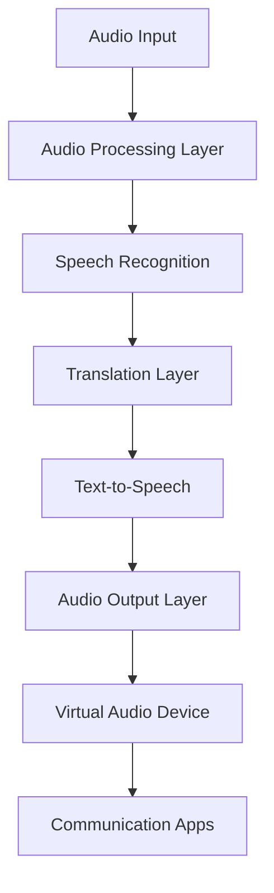

# Technical Documentation

## System Architecture

### Overview



### Component Details

#### 1. Audio Processing Layer

**Core Components:**
- PyAudio for audio capture
- PipeWire/PulseAudio virtual devices
- Audio buffer management

**Key Classes:**
```python
class AudioManager:
    # Handles audio device management
    # Buffer configuration
    # Stream processing

class AudioRouter:
    # Virtual device setup
    # Audio routing logic
    # Stream synchronization
```

**Configuration Parameters:**
- Buffer Size: 512-4096 samples
- Sample Rate: 16000-48000 Hz
- Channels: 1-2
- Format: Float32

#### 2. AI Processing Layer

**Speech Recognition:**
- Model: Whisper AI via ollama
- Supported formats: PCM audio
- Batch processing size: Configurable (100ms-2000ms)

**Translation:**
- Model: Local LLM (ollama)
- Processing: Real-time stream translation
- Language pairs: Configurable

**Text-to-Speech:**
- Primary Engine: Kokoro (for English synthesis)
- Backup Engine: Coqui TTS
- Voice models: Customizable
- Output format: PCM audio
- Support for transcription files import

#### 3. User Interface

**Main Components:**
- Audio device selection
- Language configuration
- Profile management
- Audio visualization
- Status monitoring

## Data Flow

### Audio Processing Pipeline

1. **Input Stage**


2. **Processing Stage**


3. **Output Stage**


## Performance Optimization

### Audio Processing
- Buffer size optimization
- Stream synchronization
- Latency management

### AI Processing
- Model quantization
- Batch size tuning
- Memory management

## Configuration

### Audio Settings
```yaml
audio:
  input:
    device: "default"
    sample_rate: 16000
    channels: 1
    buffer_size: 1024
  output:
    device: "virtual_output"
    sample_rate: 48000
    channels: 2
```

### AI Model Settings
```yaml
models:
  whisper:
    model_size: "medium"
    language: "auto"
  translator:
    model: "mistral"
    temperature: 0.7
  tts:
    model: "coqui-tts"
    voice: "default"
```

## Development Guidelines

### Adding New Features

1. Audio Processing:
   - Implement in `audio/` directory
   - Follow buffer management patterns
   - Add tests for new components

2. AI Integration:
   - Add models in `models/` directory
   - Implement model interface
   - Add performance benchmarks

3. UI Components:
   - Follow Qt design patterns
   - Use provided base classes
   - Implement error handling

### Testing

1. Unit Tests:
   - Audio processing
   - AI model integration
   - UI components

2. Integration Tests:
   - End-to-end audio pipeline
   - Translation accuracy
   - System performance

3. Performance Tests:
   - Latency measurements
   - Resource usage
   - Long-running stability

## Deployment

### System Requirements

- CPU: 4+ cores
- RAM: 8GB minimum (16GB recommended)
- Storage: 10GB for models
- GPU: Optional, improves performance

### Installation Verification

1. Audio Setup:
```bash
# Test virtual devices
pactl list sinks
pactl list sources
```

2. Model Setup:
```bash
# Verify model downloads
ls -l models/
ollama list
```

3. System Check:
```bash
# Run diagnostics
./scripts/system_check.sh
```

## Troubleshooting

### Common Issues

1. Audio Routing:
   - Check PipeWire/PulseAudio status
   - Verify device permissions
   - Monitor audio levels

2. Model Performance:
   - Check resource usage
   - Verify model loading
   - Monitor translation quality

3. Integration:
   - Test virtual device routing
   - Verify app permissions
   - Check audio format compatibility

## Security Considerations

1. Local Processing:
   - All AI processing is local
   - No data leaves the system
   - Model isolation

2. System Access:
   - Audio device permissions
   - Model file permissions
   - Configuration security

## Future Improvements

1. Performance:
   - GPU acceleration
   - Model optimization
   - Reduced latency

2. Features:
   - Additional languages
   - Custom voice models
   - Advanced audio processing

3. Integration:
   - More communication platforms
   - API development
   - Plugin system